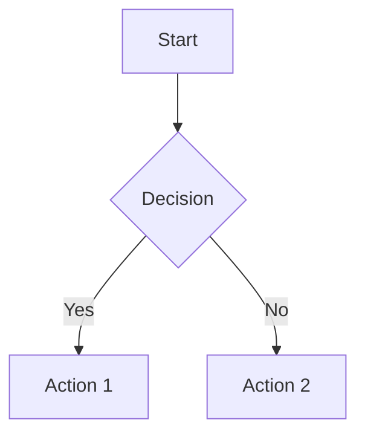

# Heading 1 (H1)

test
## Heading 2 (H2)

test
### Heading 3 (H3)
test
#### Heading 4 (H4)

##### Heading 5 (H5)

###### Heading 6 (H6)

**Bold Text** and *Italic Text*  
__Alternative Bold__ and _Alternative Italic_  
***Bold Italic*** or ___Bold Italic___  
~~Strikethrough Text~~

---

## Lists
- Unordered List Item 1
- Unordered List Item 2
  - Nested Item 2a
  - Nested Item 2b

1. Ordered List Item 1
2. Ordered List Item 2
   1. Nested Ordered 2a
   2. Nested Ordered 2b

- [ ] Task List Item 1
- [x] Completed Task

## Links & Images
[Inline Link](https://example.com)  


_This is a surveillance camera mounted on a building wall_

https://autolink.example.com


## Code
Inline `code test for a linux command` example  
```python
def hello_world():
    print("Python code block")
```

```javascript
console.log("JavaScript highlighting");
```

## Tables
| Syntax      | Description | Test Text     |
| ----------- | ----------- | ------------- |
| Header      | Title       | Here's this   |
| Paragraph   | Text        | And more      |
| Left-Align  | Center      | Right-Align   |
|:----------- |:-----------:| ------------: |

## Blockquotes
> Standard blockquote  
> Multiple line  
> Continuation

> **Nested Blockquote**  
> > With inner quote  
> > > And deeper level

## Math (LaTeX)
Inline math: $E = mc^2$

Block math:
$$
\begin{bmatrix}
1 & 0 \\
0 & 1
\end{bmatrix}
$$

## Horizontal Rules
***
---
___

## HTML Elements
<button>HTML Button</button>  
<span style="color:red">Red Text</span>

## Special Characters
* Emoji: 😊 👍 🚀
* Entities: &copy; &amp; &lt; &gt;

## Footnotes
Here's a sentence with a footnote.[^1]

[^1]: This is the footnote content.

## Definition Lists
Term 1
: Definition 1

Term 2
: Definition 2a
: Definition 2b

## Mermaid Diagram (if supported)


## Admonitions (if supported)
!!! note
    This is a note admonition

!!! warning "Custom Title"
    This is a warning with custom title


Key elements to test rendering:
1. Headings hierarchy (H1-H6)
2. Text formatting (bold, italic, strikethrough)
3. Different list types (nested, task, definition)
4. Table alignment and formatting
5. Code blocks with syntax highlighting
6. Math equations (requires MathJax/KaTeX support)
7. Various horizontal rule styles
8. HTML embedding capability
9. Footnotes and special characters
10. Mermaid diagrams (if supported by your renderer)
11. Admonitions (if supported)
12. Different link types (inline, reference, auto-links)
13. Nested blockquotes
14. Image rendering with alt text

The actual rendering will depend on your Markdown parser/renderer (e.g., GitHub Flavored Markdown, VS Code, Obsidian, etc.). Some elements like math equations, mermaid diagrams, and admonitions require specific extensions or processors.